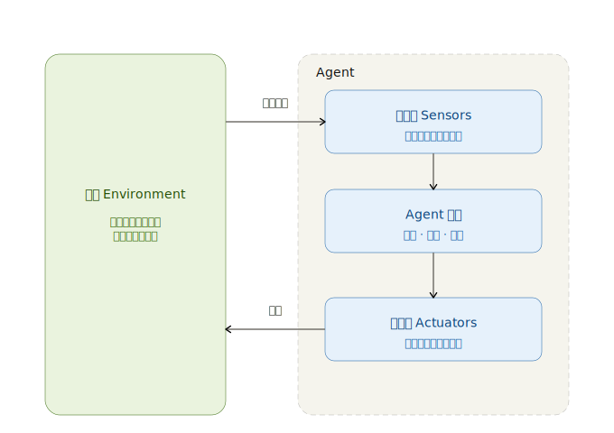

# Agent 是什么

## 1. AI ≠ Agent

我相信，这篇文章的读者，大概率经历过 2026 年初的龙虾焦虑，也起码用过至少一款 AI 应用（手机端/网页端，国内/国外不限），但是未必对当前的基于大语言模型（LLM）的 AI 和智能体 （Agent）的基础概念有较为明确的了解，因此在本章开头做一个快速科普。

### 1.1. 什么是 LLM

LLM 是一个神经网络黑盒。神经网络可以视为一个复杂函数。

LLM 通过不断预测下一个词元（Token，简单理解为词也行）来补全一个句子，直到输出停止输出的符号。

注意，在上面的定义里面，我们并没有要求 LLM 输出的词是什么。实际上LLM作为 **生成式人工智能**（Generative AI）的一员，本身可以输出任意的字符。

因此，LLM能够输出：

1.  任意能被文字符号描述的内容，比如 emoji，字符画等等；
2.  任意能被转换成文字符号的内容，比如代码，网页，流程图，甚至图片本身（矢量图，不大的像素图），等等。

### 1.2. 什么是 Agent

1990 年代的经典教材《Artificial Intelligence: A Modern Approach》将 Agent 定义为：

```python
能够通过 sensors 感知环境，并通过 effectors 或 actuators 作用于环境的实体。
```

这个定义一直延续到今天，仍然是理解 Agent 的最基础框架。

Agent 不是单纯的 LLM 模型文件，也不是单纯的聊天机器人。一个 Agent 至少包含以下几个部分：

1.  **Agent 核心**：负责状态维护、推理、规划、决策与行动选择；
2.  **感受器（Sensors）**：负责从环境中获取信息，例如用户输入、文件内容、网页、数据库、API 返回值、图像、日志等；
3.  **作用器/执行器（Effectors / Actuators）**：负责对环境施加影响，例如回复用户、调用工具、写入文件、执行代码、发送请求、控制机器人等；
4.  **环境（Environment）**：Agent 所处并与之交互的外部世界，可以是真实物理世界，也可以是软件系统、网页、命令行、游戏、交易市场或多智能体系统。

Agent 一定要被放在**可交互的环境**中。孤立的模型只能产生文本。Agent 要能够在环境中不断执行感知、决策、行动的闭环流程。

Agent 核心可以是：

1.  LLM：现在的默认配置。起源于[姚顺雨](https://ysymyth.github.io/) 2023年发表的论文 [ReAct](https://arxiv.org/pdf/2210.03629)。后文提到的 Agent 默认为 LLM Agent；

2.  其他的深度学习模型：比如小一些的机器学习黑箱。这是2000年左右的热门领域，代表是能玩上世纪末各种红白机游戏的 Atari，OpenAI 的星际争霸 AI，以及杀穿人类围棋界的 AlphaGo；

3.  一套规则：规则可简单、可复杂。量化金融领域经常通过规则集进行复杂且精细的仓位管理；

4.  一只猪：猪脑+猪身 = 猪Agent ，在猪圈中运行，因此猪圈里的猪也是一种 Agent；相反地，真空中的球形猪不是 Agent。

{: .centered-image }

一个典型的 Agent 结构和流程如下图。

{: .centered-image .flow-diagram }

## 2. 注意

1.  LLM 本身并不能构成 Agent。只有当 LLM 被放入“感知—决策—行动—反馈” 的闭环中，并能通过工具或执行器持续影响环境时，我们才能称它为一个 Agent。

2.  当前（几乎）所有网页端 LLM 都是 Agent，因为（几乎）所有网页端 LLM 服务，都至少带有网络搜索工具。大模型调用网络搜索工具获取基本信息，理解信息后做出回答；一些网页端 LLM 还能理解并创建更复杂的多媒体文件；部分网页端 LLM 甚至能主动创建、整理用户的记忆。

3.  本教程后续提到 Agent 时，均默认为 **LLM Agent**。 现代 LLM Agent 起源于[姚顺雨](https://ysymyth.github.io/) 的 [ReAct](https://arxiv.org/pdf/2210.03629) 一文，文章继承了上面的 Agent 的工作流程并将其扩展到了 LLM Agent 中。
