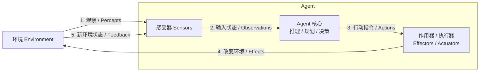

# Agent 是什么

## 1. AI ≠ Agent

这篇文章的读者大概已经了解过今年年初的龙虾焦虑，也起码用过至少一款 AI 应用（手机端/网页端），但是未必对当前的基于大语言模型（LLM）的 AI 和 Agent 这两个东西有比较明确的了解，因此在开头做一个快速科普。

### 1.1. 什么是 LLM

LLM 是一个神经网络黑盒。LLM 通过不断预测下一个词元（Token，简单理解为词也行）来补全一个句子，直到输出停止输出的符号。

注意，我们并没有要求 LLM 输出的词是什么。实际上LLM作为 **生成式人工智能**（Generative AI）的一员，本身可以输出任意能被文字符号描述的内容，或者是任意能被转换成文字符号的内容，比如代码，网页，流程图，甚至图片本身（矢量图，不大的像素图，等），等等。

### 1.2. 什么是 Agent

早在 1990 年代，AI 领域就已经形成了较清晰的 Agent 视角。经典教材《Artificial Intelligence: A Modern Approach》将 Agent 定义为：能够通过 sensors **感知环境**，并通过 effectors 或 actuators **作用于环境**的实体。这个定义一直延续到今天，仍然是理解 Agent 的最基础框架。

从这个角度看，Agent 不是单纯的模型，也不是单纯的聊天机器人。一个 Agent 至少包含以下几个部分：

1.  **Agent 核心**：负责状态维护、推理、规划、决策与行动选择；
2.  **感受器（Sensors）**：负责从环境中获取信息，例如用户输入、文件内容、网页、数据库、API 返回值、图像、日志等；
3.  **作用器/执行器（Effectors / Actuators）**：负责对环境施加影响，例如回复用户、调用工具、写入文件、执行代码、发送请求、控制机器人等；
4.  **环境（Environment）**：Agent 所处并与之交互的外部世界，可以是真实物理世界，也可以是软件系统、网页、命令行、游戏、交易市场或多智能体系统。

Agent 一定要被放在**可交互的环境**中。孤立的模型只能产生文本。Agent 要能够在环境中不断执行感知、决策、行动的闭环流程。

Agent 核心可以是：

-   LLM：现在的默认配置，起源于[姚顺雨](https://ysymyth.github.io/) 2023年发表的论文 [ReAct](https://arxiv.org/pdf/2210.03629)。后文默认都是LLM Agent；
-   深度学习模型：小一些的黑箱，这是2000年左右的热门领域。代表是打砖块 AI，OpenAI 的星际AI，以及打穿围棋界的 AlphaGo；
-   一套规则：规则可简单可复杂。量化金融领域经常通过复杂规则集来进行精细的仓位管理；
-   一只猪（猪脑+猪身 = 猪Agent ，在猪圈中运行，因此猪圈里的猪也是一种 Agent；相反地，真空中的球形猪不是  Agent）

一个典型的 Agent 结构和流程如下图。A

 LLM 本身并不自动等于 Agent。只有当 LLM 被放入“感知—决策—行动—反馈”的闭环中，并能通过工具或执行器持续影响环境时，我们才更适合称它为一个 Agent。

当前的所有网页端 LLM 都是 Agent. 所有网页端 LLM服务至少带有网络搜索工具。部分网页端 LLM 甚至带有主动创建、整理用户记忆的相关工具组。

本教程后续提到 Agent 均默认为 **LLM Agent**. 现代 LLM Agent 起源于[姚顺雨](https://ysymyth.github.io/) 的 [ReAct](https://arxiv.org/pdf/2210.03629) 一文，文章继承了上面的 Agent 的工作流程并将其扩展到了 LLM Agent 中。

下一步：[Agent 交互形态演化](forms.md)。
